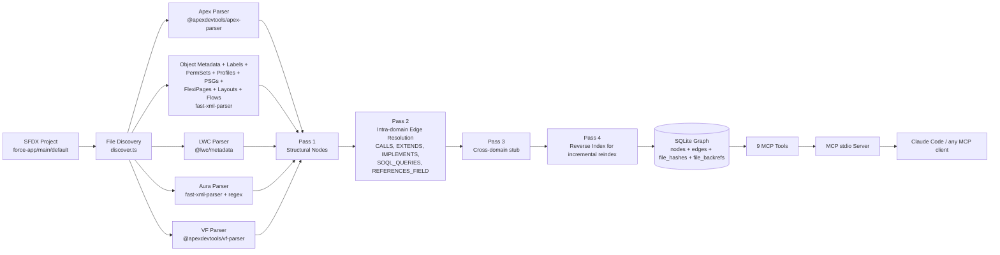

# Spindle

**A local-first MCP server that indexes SFDX projects into a queryable metadata graph.**

Spindle replaces grep-and-read loops with single-call graph queries for Salesforce-shaped questions: "who calls this method", "what references this field", "who can access this class". The graph treats every metadata artifact as a first-class node (Apex classes, LWC bundles, Aura components, SObjects, fields, validation rules, Visualforce pages) and every reference between them as a typed edge.

| | |
|---|---|
| **Status** | v0.5 + v1.0 distribution — 101 tests passing, 9 MCP tools live, GitHub Actions matrix release wired up |
| **Headline** | On a 100-class synthetic corpus, returns answers in ~25% of the tokens a grep+read flow would use, ~160x faster |
| **Distribution** | Single Bun-compiled binary per platform via GitHub Releases. Cross-compile to darwin-arm64, darwin-x64, linux-x64, linux-arm64, windows-x64 validated. Matrix build wired into `.github/workflows/release.yml`. |
| **License** | MIT |

See `sfdx-graph-mcp-design.md` for the full design document and `CHANGELOG.md` for what's actually shipped.

---

## Why

Claude Code (and similar coding agents) currently navigate SFDX projects the same way they navigate any other codebase: grep, glob, and read files one at a time. For SFDX this is uniquely wasteful because:

- A single field can be referenced in Apex, LWC, Aura, Flow XML, validation rules, layouts, permission sets, profiles, email templates, and formula fields on related objects. No grep query covers all of these correctly.
- "Who can run this Apex method" requires joining classes, permission sets, profiles, and permission set groups. Grep returns noise; the answer is a graph traversal.
- Metadata XML is verbose — reading a single object folder can mean dozens of small files of structural ceremony around one fact.

Spindle indexes the project once into SQLite (~600ms for a 100-class project), then answers structural questions in sub-millisecond graph queries.

---

## Agent output and shared service

Search now returns compact symbol evidence by default, with `detail: "full"` for
parser properties and `has_more` / `next_offset` for complete pagination. On the same
50-class result page, the included benchmark measures 67.1% fewer output bytes.

All MCP clients, CLI indexing and SessionStart hooks share one local graph service
per database. Each stdio client keeps a thin adapter; the service owns the database
and one watcher per project. It shuts down after the final client disconnects and
recovers singleton ownership after crashes. No configuration change is needed for
existing stdio clients. `register-hook` removes obsolete SessionEnd stop-watch hooks.

See [implementation, upstream comparison, measurements and limitations](docs/optimization-notes.md).

## Quick start

### One-line install (once a release is tagged)

POSIX (macOS / Linux):

```bash
curl -fsSL https://raw.githubusercontent.com/Marceswan/Spindle/main/install.sh | sh
```

Windows (PowerShell):

```powershell
iwr -useb https://raw.githubusercontent.com/Marceswan/Spindle/main/install.ps1 | iex
```

The installer detects your platform, downloads the matching binary from the latest GitHub Release, verifies its SHA256 against the release's `SHA256SUMS` file, and installs to `/usr/local/bin` (or `~/.local/bin` if the former isn't writable) on POSIX, or `$LOCALAPPDATA\Programs\spindle` on Windows.

Env vars to control behavior:
- `SPINDLE_VERSION=v0.5.0` pin to a tag (default: latest)
- `SPINDLE_PREFIX=/opt/spindle/bin` override the install location
- `SPINDLE_REPO=other/fork` override the source repo

### Run from source

```bash
git clone https://github.com/Marceswan/Spindle.git
cd Spindle
bun install
bun test                  # 85 tests
bun run typecheck         # tsc --noEmit
bun run build             # -> dist/sfdx-graph-mcp (single-binary, ~62MB)
```

### Index an SFDX project

```bash
sfdx-graph-mcp index /path/to/your/sfdx-project --full
```

The shared database defaults to `~/.cache/sfdx-graph-mcp/graph.db`. Set `SFDX_GRAPH_HOME` to share a different database directory across clients, or pass `--db-path` to isolate a CLI run.

To run a continuously-updated graph during active development, add `--watch`:

```bash
sfdx-graph-mcp index /path/to/your/sfdx-project --watch
```

Spindle indexes through the shared service, which owns a single `chokidar` watcher per project. File changes are debounced 300ms and trigger an incremental reindex (typically 20-50ms per changed file). Ctrl+C shuts down cleanly.

### Configure as an MCP server in Claude Code

After the one-line install, `.mcp.json` in your project root:

```json
{
  "mcpServers": {
    "sfdx-graph": {
      "type": "stdio",
      "command": "/usr/local/bin/sfdx-graph-mcp"
    }
  }
}
```

Use an absolute path — relative paths and `$PATH` lookup behave inconsistently across MCP clients. The one-line installer prints the right path to use when it finishes.

For development without installing the binary, use `bin/sfdx-graph-mcp` (a shim that runs `bun src/cli.ts`).

Recommended `CLAUDE.md` snippet to prefer Spindle's tools over grep:

```
## SFDX Graph (sfdx-graph-mcp)

Prefer graph tools over Grep/Glob/Read for structural SFDX questions.

- "Who calls X" or "what does X call":      trace_references
- "What references this field":             get_field_usage (one call, all metadata types)
- "Read source for symbol":                 get_source_snippet (preferred over Read for indexed files)
- "Find Apex methods matching pattern X":   search_graph
- "Orient me in the project":               get_schema

Run index_project at the start of any non-trivial SFDX task.
Use Grep only for string literals, comments, or files outside the indexer's coverage.
```

### Run the benchmarks

```bash
bun run bench                              # Phase A: canonical queries vs sample fixture
bun run bench --compare --size 100         # Phase B: vs grep+read on a 100-class synthetic corpus
bun run bench --generate --size 1000 --out /tmp/big-corpus
```

---

## MCP tool surface

Nine tools live; each handler is a TypeScript file under `src/tools/`.

| Tool | What it answers |
|---|---|
| `index_project` | Build or refresh the graph for an SFDX project (full or incremental) |
| `list_projects` | List indexed projects in the database |
| `get_schema` | Per-label node counts, per-type edge counts, sample names — orient yourself in a graph |
| `search_graph` | Filtered structural search by label, name regex, qualified name regex, file glob, properties, relationships, degree |
| `trace_references` | BFS up to a configurable depth from a start node, in/out/both, filtered by edge type and confidence |
| `get_source_snippet` | Return source code for a graph node with optional context lines — replaces a separate file Read |
| `diff_projects` | Paginated semantic comparison of two indexed org source snapshots |
| `get_field_usage` | Every reference to a field across LWC, VF, validation rules, FlexiPages, layouts, Apex SOQL/DML, and Flows — grouped by usage type with a three-tier `coverage` summary (authoritative / indirect / pending) |
| `get_permission_access` | Every PermissionSet and Profile that grants access to a given ApexClass / SObject / Field / VisualforcePage / RecordType. Walks PermissionSetGroup membership to surface indirect grants |
| `query_graph` | Arbitrary openCypher-subset queries (MATCH, WHERE, RETURN, ORDER BY, LIMIT, SKIP, count). For the long-tail questions the typed tools don't cover |

---

## Architecture



### Pipeline passes

1. **Pass 1 — discovery + structural.** For each discovered file: if content hash matches stored hash, skip. Otherwise dispatch to the right parser (`parse-dispatch.ts`), then in a single SQLite transaction delete stale nodes and insert fresh ones.
2. **Pass 2 — intra-domain edges.** Build a symbol table from all nodes; resolve EXTENDS / IMPLEMENTS / INSTANTIATES / CALLS by short-name lookup against the project's own symbols. Write in-file edges (DEFINES_METHOD, SOQL_QUERIES, REFERENCES_FIELD, etc.) and apply a fallback resolver when target qnames are unparameterized (e.g., LWC `@salesforce/apex` imports point at `AccountService.cleanup` not `AccountService.cleanup()`).
3. **Pass 3 — cross-domain.** Currently a stub; future home for richer multi-domain resolution.
4. **Pass 4 — reverse index.** Populates `file_backrefs` so incremental reindex knows which files to re-resolve when a dependency changes.

---

## Status

```mermaid
graph TB
    subgraph Done[" ✅ Shipped in v0.1 → v0.5 + v1.0 distribution "]
        Apex2[Apex parser<br/>classes, triggers, methods,<br/>extends/implements, SOQL]
        Meta2[Object metadata + CustomLabel<br/>SObject, Field, ValidationRule, RecordType, CustomLabel]
        LWC2[LWC parser<br/>via @lwc/metadata]
        Aura2[Aura parser<br/>handwritten]
        VF2[Visualforce parser<br/>via @apexdevtools/vf-parser]
        Perm3[Permission graph<br/>PermSet, Profile, PSG +<br/>get_permission_access tool]
        FlexLayout3[FlexiPage + Layout parsers]
        Flow3[Flow XML parser<br/>actionCalls + record DML + subflows]
        StaticEmail4[StaticResource + EmailTemplate<br/>parsers]
        Watch4[chokidar watch mode<br/>incremental reindex on file change]
        Cypher5[Cypher query layer<br/>+ query_graph tool]
        Tools2[9 MCP tools]
        Bench2[Bench Phase A + B<br/>synthetic corpus + grep baseline]
        Dist1[Cross-platform binaries<br/>+ install.sh / install.ps1<br/>+ GitHub Actions matrix release]
    end

    subgraph Soon[" ✅ v1.2 extraction and queries "]
        FlowAdv4[Flow assignments / decisions / formulas<br/>variable-to-SObject binding]
        OptCypher[OPTIONAL MATCH + WITH chaining<br/>+ count grouping]
        SOQL4[Full SOQL parser<br/>replaces regex]
    end

    subgraph Later[" ✅ v1.2 tools and distribution "]
        SelfUpdate[Self-update command<br/>+ GPG-signed checksums]
        WebUI[Read-only Web UI<br/>for offline exploration]
        Diff[Multi-org diff mode]
    end

    Done --> Soon --> Later
```



---

## Bench headline

A 100-class synthetic corpus (907 nodes, 967 edges, indexed in 1.3 seconds) against the 8 canonical queries:

```
| Query                                | Spindle (tokens / ms) | Grep+Read (tokens / ms) | Token ratio | Speedup |
|--------------------------------------|------------------------|--------------------------|-------------|---------|
| trace-outbound-from-orchestrator-run | 6 / 0.34              | 0 / 75.57                | N/A         | 219x    |
| get-schema-summary                   | 144 / 1.06            | 845 / 2.19               | 17.0%       | 2.1x    |
| search-all-apex-classes              | 6248 / 0.46           | 19040 / 77.73            | 32.8%       | 170x    |
| search-apex-trigger                  | 216 / 0.25            | 0 / 96.51                | N/A         | 392x    |
```

Across queries with non-zero grep tokens: **Spindle uses 24.9% of grep's tokens on average and is 148x faster.** N/A ratios are queries whose hand-fixture-derived grep patterns happen to match zero bytes in the synthetic corpus — see `bench/README.md` for the methodology.

Run `bun run bench --compare --size 1000` for a 1000-class corpus.

---

## Development

```bash
bun install
bun run typecheck     # tsc --noEmit, strict + exactOptionalPropertyTypes
bun test              # bun:test, parallel by file
bun run bench         # Phase A against the sample fixture
```

Conventions live in `CLAUDE.md`. Gotchas live in `learnings.md` (read it before authoring parsers — ANTLR whitespace stripping, `exactOptionalPropertyTypes` patterns, bun:test hook timeouts, etc.). Architecture is in `sfdx-graph-mcp-design.md`.

---

## v1.2 usage and boundaries

Force a full reindex of existing projects to populate the new references:

```sh
sfdx-graph-mcp index /path/to/project --full
sfdx-graph-mcp ui
sfdx-graph-mcp diff 1 2 --limit 25
sfdx-graph-mcp update --check
```

The read-only browser UI prints a private loopback URL. It supports symbol search,
source evidence, inbound references, and snapshot comparison through the shared
service. Closing it disconnects its client; other clients keep their service session.

`diff_projects` is the tenth MCP tool. Index two retrieved org source directories in
the same database, then compare their project IDs. Results are paginated and compare
API names, properties, source hashes, and relationships while ignoring local paths
and database IDs. `--metadata-only` excludes source hashes. This compares indexed
source snapshots, not live org state.

Flow extraction now follows typed variables, decisions, assignments, formulas, and
record operations. Formula references carry heuristic confidence; relationship
traversal and screen/choice-specific references remain incomplete. SOQL extraction
uses the Apex parser grammar, including nested queries, filters, grouping, ordering,
TYPEOF and metadata-resolved relationships. Dynamic query strings remain unresolved;
`FIELDS()` does not enumerate wildcard fields. These limits appear in index warnings.

Cypher supports repeated `MATCH`, `OPTIONAL MATCH`, and `WITH` stages, nullable
optional bindings, aliases, `DISTINCT`, `count` grouping, and stage pagination.
Each MATCH supports one directed edge; chain clauses for longer paths. Predicates
retain the existing equality/string subset, ordering accepts one key, and aggregates
other than `count`, variable-length paths, and `UNWIND` are unsupported.

Self-update verifies GPG-signed, version-bound checksums before atomic installation,
with backup and rollback on macOS/Linux. Windows requires manual replacement.
**Release signing needs one-time key and GitHub secret setup before publishing.**
Development builds fail closed without an embedded trusted key. Follow
[the release-signing guide](docs/release-signing.md) for setup and update commands.

## Roadmap

v1.0 ships a single self-contained Bun-compiled binary per platform via GitHub Releases. Current phase progress:

- ✅ **v0.1** — Apex-only graph
- ✅ **v0.2** — Object metadata + LWC + Aura + VF + `get_field_usage`
- ✅ **v0.3** — CustomLabel + Permission graph + FlexiPage + Layout + Flow + `get_permission_access`
- ✅ **v0.4** — StaticResource + EmailTemplate + chokidar watch mode + Bun-compiled binary validated
- ✅ **v0.5** — Cypher query layer + `query_graph` MCP tool
- ✅ **v1.0 distribution** — Cross-platform matrix release wired up; install scripts; LICENSE/SECURITY/CONTRIBUTING (current snapshot — tag a `v*.*.*` release to publish binaries)
- ✅ **v1.2 extraction** — Advanced Flow extraction (variables, decisions, formulas); OPTIONAL MATCH + WITH chaining in Cypher; full SOQL parser replacing the regex
- ✅ **v1.2 tooling** — Self-update + GPG-signed checksums; read-only web UI; multi-org diff mode

See `sfdx-graph-mcp-design.md` §14 for the original roadmap.

---

## License

MIT. The full source is in this repository; the v1.0 binaries will be reproducible from source.

There is no paid tier and no commercial license. GitHub Sponsors is the only optional support channel. Sponsorship buys nothing material; it expresses support. This keeps the project unencumbered by commercial obligations and focused on technical correctness.
