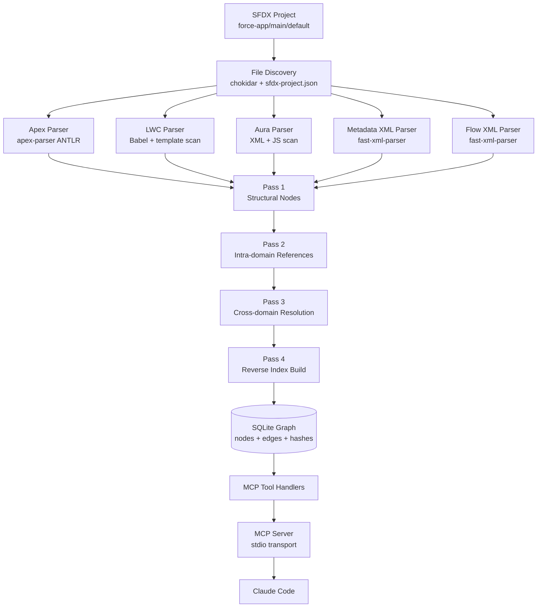

# Spindle: SFDX Metadata Graph MCP Server

**Working name:** `sfdx-graph-mcp`
**Product name (placeholder):** Spindle
**Document type:** Solution Design
**Status:** Draft v0.1
**Author:** Marc

-----

## 1. Vision

A local-first MCP server that indexes an SFDX project into a queryable metadata graph, exposing structural and reference-level intelligence to Claude Code (and any MCP-compatible client) through a small set of typed tools. The graph treats every metadata artifact as a first-class node (Apex classes, LWC bundles, Aura components, SObjects, fields, permission sets, flows, layouts) and every reference between them as a typed edge (calls, queries, DML operations, field references, access grants, template bindings, invocations).

The product replaces expensive grep-and-read loops for structural questions with single-call graph queries, while leaving free-text grep available as a fallback. The target end state is a single self-contained binary distributed exclusively via GitHub Releases, with zero runtime dependencies on package registries or external services. Users download one file per platform, mark it executable, and point their MCP client at its absolute path. Source is open under MIT license in the same repository.

## 2. Problem Statement

Claude Code (and similar coding agents) currently navigate SFDX projects the same way they navigate any other codebase: grep, glob, and read files one at a time. For SFDX this is uniquely wasteful because:

1. **Metadata is XML-heavy and verbose.** Reading a single object folder can mean dozens of `.field-meta.xml` files, each hundreds of bytes of structural ceremony around one fact.
1. **References are scattered across formats.** A single field can be referenced in Apex (typed and in SOQL string literals), LWC (`@salesforce/schema` imports, template bindings, wire adapters), Aura (component attributes, controller actions), Flow XML, validation rule formulas, layouts, permission sets, profiles, email templates, report types, and formula fields on related objects. No grep query covers all of these correctly.
1. **The Apex semantic model is non-trivial.** Static method calls, instance method dispatch, interface implementations, trigger context, SOQL inline syntax, DML statements, `@AuraEnabled` exposure, `@InvocableMethod` exposure, `@future` and queueable semantics: all of these matter for “what runs when X happens” questions.
1. **Permission and access traversal is multi-hop.** “Who can run this Apex method?” requires joining classes, permission sets, profiles, and permission set groups. Grep returns noise; the answer is a graph traversal.
1. **Existing tools don’t speak MCP.** PMD-Apex, ApexLink, sfdx-scanner, and the Salesforce CLI each address parts of the problem, none expose a queryable graph to an LLM via MCP.

The result is that for SFDX work specifically, Claude Code burns tokens reading XML it doesn’t need and still misses references. A focused graph layer reduces this dramatically (the polyglot precedent measured 99.2% token reduction on five queries against a 2,348-node graph; SFDX should see comparable or better given the metadata-to-code ratio).

## 3. Goals and Non-Goals

### Goals

- **G1.** Index a complete SFDX project (`force-app/main/default` plus additional package directories defined in `sfdx-project.json`) into a typed metadata graph.
- **G2.** Support incremental reindex via content hashing, with sub-second latency for single-file changes.
- **G3.** Expose 10 to 12 MCP tools covering structural search, reference traversal, source snippet retrieval, and a free-text fallback.
- **G4.** Resolve cross-domain references that grep cannot: Apex to SObject/Field, LWC to Apex `@AuraEnabled`, Flow to Apex `@InvocableMethod`, Permission Set to Apex/Object/Field, layout to field, validation rule formula to field.
- **G5.** Single self-contained binary per platform. Zero runtime dependencies: no Node, no Java, no package manager, no external services. Users download the binary from GitHub Releases and run it directly.
- **G6.** Persist the graph to disk so restarts don’t require re-indexing.
- **G7.** Run entirely offline against local source. No org connection required.

### Non-Goals (v1)

- **NG1.** Live org metadata fetch. The graph is built from local source only. Pulling fresh metadata is the user’s responsibility via `sf project retrieve`.
- **NG2.** Managed package introspection. Installed managed packages are referenced as opaque external nodes by namespace only.
- **NG3.** Apex test execution or coverage data. Static analysis only.
- **NG4.** Full SOQL semantic analysis (relationship traversal correctness, polymorphic relationship resolution). v1 captures the dominant patterns; full correctness is v2+.
- **NG5.** Flow execution simulation. Flow XML is parsed for structure and references only.
- **NG6.** Multi-org diffing. v1 is per-project.
- **NG7.** A web UI. Stdio MCP server only.

## 4. Architecture

### 4.1 System Overview



### 4.2 Component Responsibilities

- **File Discovery** walks `sfdx-project.json` `packageDirectories`, applies `.forceignore` plus its own `.sfdx-graph-ignore`, classifies files by metadata type via path conventions and suffix, and emits a work queue. Uses chokidar for watch mode.
- **Parsers** are pure functions per metadata type. Each takes `(filePath, fileContents)` and returns `(nodes[], edges[], unresolvedRefs[])`. Unresolved references are deferred to pass 3.
- **Indexing Pipeline** runs four passes (described in section 7) to keep parsers ignorant of cross-file resolution.
- **Storage Layer** owns the SQLite database, schema migrations, content-hash tracking, and the transactional reindex API.
- **MCP Tool Handlers** are thin wrappers over typed query functions. Each tool maps to one or two underlying queries.
- **MCP Server** is the official `@modelcontextprotocol/sdk` stdio server.

## 5. Graph Data Model

### 5.1 Node Labels

|Label               |Source                                                       |Identity                                |
|--------------------|-------------------------------------------------------------|----------------------------------------|
|`Project`           |`sfdx-project.json`                                          |project root path                       |
|`PackageDirectory`  |`sfdx-project.json` entries                                  |relative path                           |
|`ApexClass`         |`*.cls` + `*.cls-meta.xml`                                   |fully qualified name including namespace|
|`ApexTrigger`       |`*.trigger` + `*.trigger-meta.xml`                           |trigger name                            |
|`ApexMethod`        |inside `ApexClass`/`ApexTrigger`                             |`ClassName.methodName(paramTypes)`      |
|`ApexProperty`      |inside `ApexClass`                                           |`ClassName.propertyName`                |
|`ApexInterface`     |`*.cls` with `interface` keyword                             |qualified name                          |
|`ApexEnum`          |`*.cls` with `enum` keyword                                  |qualified name                          |
|`LwcBundle`         |`lwc/<name>/` folder                                         |bundle name                             |
|`LwcModule`         |`lwc/<name>/<name>.js`                                       |bundle name                             |
|`LwcTemplate`       |`lwc/<name>/<name>.html`                                     |bundle name                             |
|`LwcMetaConfig`     |`lwc/<name>/<name>.js-meta.xml`                              |bundle name                             |
|`AuraBundle`        |`aura/<name>/` folder                                        |bundle name                             |
|`AuraComponent`     |`aura/<name>/<name>.cmp`                                     |bundle name                             |
|`AuraController`    |`aura/<name>/<name>Controller.js`                            |bundle name                             |
|`AuraHelper`        |`aura/<name>/<name>Helper.js`                                |bundle name                             |
|`SObject`           |`objects/<name>/<name>.object-meta.xml`                      |API name                                |
|`Field`             |`objects/<name>/fields/<field>.field-meta.xml`               |`Object.Field__c`                       |
|`RecordType`        |`objects/<name>/recordTypes/<rt>.recordType-meta.xml`        |`Object.RecordTypeName`                 |
|`ValidationRule`    |`objects/<name>/validationRules/<vr>.validationRule-meta.xml`|`Object.RuleName`                       |
|`Layout`            |`layouts/<name>.layout-meta.xml`                             |layout API name                         |
|`FlexiPage`         |`flexipages/<name>.flexipage-meta.xml`                       |flexipage API name                      |
|`PermissionSet`     |`permissionsets/<name>.permissionset-meta.xml`               |API name                                |
|`PermissionSetGroup`|`permissionsetgroups/<name>...`                              |API name                                |
|`Profile`           |`profiles/<name>.profile-meta.xml`                           |API name                                |
|`Flow`              |`flows/<name>.flow-meta.xml`                                 |API name                                |
|`CustomLabel`       |`labels/CustomLabels.labels-meta.xml`                        |label API name                          |
|`CustomMetadataType`|`objects/<name>__mdt/...`                                    |API name with `__mdt` suffix            |
|`StaticResource`    |`staticresources/<name>.resource-meta.xml`                   |API name                                |
|`EmailTemplate`     |`email/...`                                                  |folder/templateName                     |
|`NamedCredential`   |`namedCredentials/<name>...`                                 |API name                                |
|`ExternalNamespace` |inferred                                                     |namespace prefix                        |

### 5.2 Common Node Properties

All nodes carry:

- `id` (auto-increment integer)
- `label` (one of the above)
- `name` (short name)
- `qualified_name` (globally unique within graph)
- `file_path` (relative to project root, null for derived nodes)
- `start_line`, `end_line` (null when not applicable)
- `properties` (JSON blob for label-specific properties)
- `content_hash` (sha1 of source span, used for incremental reindex)

Label-specific properties live in the JSON blob. Examples:

- `ApexClass.properties`: `{ sharing: "with"|"without"|"inherited", isAbstract: bool, isVirtual: bool, extendsClass: string|null, implementsInterfaces: string[], apiVersion: string, isTest: bool }`
- `ApexMethod.properties`: `{ returnType: string, parameters: [{name, type}], modifiers: string[], annotations: string[], isStatic: bool, isTestMethod: bool, isAuraEnabled: bool, isInvocableMethod: bool, isFuture: bool, isRemoteAction: bool }`
- `ApexTrigger.properties`: `{ sobject: string, events: string[], apiVersion: string }`
- `Field.properties`: `{ type: string, length: int|null, required: bool, unique: bool, externalId: bool, formula: string|null, referenceTo: string|null, picklistValues: string[]|null }`
- `Flow.properties`: `{ processType: string, status: string, triggerType: string|null, triggerObject: string|null, isAutoLaunched: bool }`
- `PermissionSet.properties`: `{ label: string, isCustom: bool, license: string|null }`

### 5.3 Edge Types

|Edge Type                    |From                                                                                                     |To                            |Notes                                                                                                                   |
|-----------------------------|---------------------------------------------------------------------------------------------------------|------------------------------|------------------------------------------------------------------------------------------------------------------------|
|`CONTAINS`                   |`Project`                                                                                                |`PackageDirectory`            |structural                                                                                                              |
|`CONTAINS`                   |`PackageDirectory`                                                                                       |any metadata node             |structural                                                                                                              |
|`DEFINES_METHOD`             |`ApexClass`                                                                                              |`ApexMethod`                  |structural                                                                                                              |
|`DEFINES_PROPERTY`           |`ApexClass`                                                                                              |`ApexProperty`                |structural                                                                                                              |
|`EXTENDS`                    |`ApexClass`                                                                                              |`ApexClass`                   |inheritance                                                                                                             |
|`IMPLEMENTS`                 |`ApexClass`                                                                                              |`ApexInterface`               |inheritance                                                                                                             |
|`CALLS`                      |`ApexMethod`                                                                                             |`ApexMethod`                  |static and resolved instance calls                                                                                      |
|`INSTANTIATES`               |`ApexMethod`                                                                                             |`ApexClass`                   |`new Foo()` calls                                                                                                       |
|`THROWS`                     |`ApexMethod`                                                                                             |`ApexClass`                   |exception type, where the type is a defined class                                                                       |
|`SOQL_QUERIES`               |`ApexMethod`                                                                                             |`SObject`                     |with properties `{ fields: string[], hasWhere: bool, hasLimit: bool, hasForUpdate: bool, raw: string }`                 |
|`SOSL_QUERIES`               |`ApexMethod`                                                                                             |`SObject`                     |SOSL across multiple objects produces multiple edges                                                                    |
|`DML_ON`                     |`ApexMethod`                                                                                             |`SObject`                     |properties `{ operation: “insert”|“update”|“upsert”|“delete”|“undelete”|“merge”, isDatabaseMethod: bool, allOrNone: bool|
|`REFERENCES_FIELD`           |`ApexMethod`/`LwcModule`/`LwcTemplate`/`AuraComponent`/`Flow`/`ValidationRule`/`Layout`/`Field` (formula)|`Field`                       |the holy grail edge                                                                                                     |
|`REFERENCES_LABEL`           |`ApexMethod`/`LwcModule`/`AuraComponent`/`EmailTemplate`                                                 |`CustomLabel`                 |                                                                                                                        |
|`REFERENCES_METADATA`        |`ApexMethod`/`Flow`                                                                                      |`CustomMetadataType`          |reads of custom metadata records                                                                                        |
|`TRIGGERS_ON`                |`ApexTrigger`                                                                                            |`SObject`                     |properties `{ events: ("before insert"|"after update"|...)[] }`                                                         |
|`LWC_USES_APEX`              |`LwcModule`                                                                                              |`ApexMethod`                  |via `@salesforce/apex` import; resolves to the `@AuraEnabled` method                                                    |
|`LWC_USES_FIELD`             |`LwcModule`                                                                                              |`Field`                       |via `@salesforce/schema/Object.Field` import                                                                            |
|`LWC_USES_LABEL`             |`LwcModule`                                                                                              |`CustomLabel`                 |via `@salesforce/label/c.LabelName` import                                                                              |
|`LWC_USES_RESOURCE`          |`LwcModule`                                                                                              |`StaticResource`              |via `@salesforce/resourceUrl` import                                                                                    |
|`LWC_TEMPLATE_BINDS`         |`LwcTemplate`                                                                                            |`LwcModule`                   |property binding `{property}`                                                                                           |
|`LWC_INCLUDES_COMPONENT`     |`LwcTemplate`                                                                                            |`LwcBundle`                   |`<c-other-component>` usage                                                                                             |
|`AURA_USES_APEX`             |`AuraController`                                                                                         |`ApexMethod`                  |server-side action                                                                                                      |
|`AURA_INCLUDES_COMPONENT`    |`AuraComponent`                                                                                          |`AuraComponent` or `LwcBundle`|                                                                                                                        |
|`INVOCABLE_FROM_FLOW`        |`Flow`                                                                                                   |`ApexMethod`                  |for `@InvocableMethod` callouts                                                                                         |
|`FLOW_USES_FIELD`            |`Flow`                                                                                                   |`Field`                       |record variable field references                                                                                        |
|`FLOW_DML_ON`                |`Flow`                                                                                                   |`SObject`                     |Create/Update/Delete Records elements                                                                                   |
|`FLOW_INVOKES_FLOW`          |`Flow`                                                                                                   |`Flow`                        |subflow elements                                                                                                        |
|`LAYOUT_INCLUDES_FIELD`      |`Layout`                                                                                                 |`Field`                       |                                                                                                                        |
|`LAYOUT_INCLUDES_BUTTON`     |`Layout`                                                                                                 |`ApexClass`                   |for VF-based custom buttons                                                                                             |
|`VALIDATION_REFERENCES_FIELD`|`ValidationRule`                                                                                         |`Field`                       |parsed from formula                                                                                                     |
|`FORMULA_REFERENCES_FIELD`   |`Field`                                                                                                  |`Field`                       |for formula and roll-up summary fields                                                                                  |
|`GRANTS_APEX_ACCESS`         |`PermissionSet`/`Profile`                                                                                |`ApexClass`                   |                                                                                                                        |
|`GRANTS_OBJECT_ACCESS`       |`PermissionSet`/`Profile`                                                                                |`SObject`                     |properties `{ read, create, edit, delete, viewAll, modifyAll }`                                                         |
|`GRANTS_FIELD_ACCESS`        |`PermissionSet`/`Profile`                                                                                |`Field`                       |properties `{ read, edit }`                                                                                             |
|`GRANTS_VISUALFORCE_ACCESS`  |`PermissionSet`/`Profile`                                                                                |`ApexClass`                   |(VF pages share the model)                                                                                              |
|`INCLUDES_PERMSET`           |`PermissionSetGroup`                                                                                     |`PermissionSet`               |                                                                                                                        |
|`EMAIL_REFERENCES_FIELD`     |`EmailTemplate`                                                                                          |`Field`                       |merge field parse                                                                                                       |
|`DEPENDS_ON_EXTERNAL`        |any                                                                                                      |`ExternalNamespace`           |for managed package references                                                                                          |

### 5.4 Resolution Confidence

Some edges are resolved with full type information; some are best-effort. Each edge carries a `confidence` property:

- `1.0`: fully resolved with type info (e.g., static method call where the target class is in the project)
- `0.8`: resolved via heuristic (e.g., LWC template `<c-foo-bar>` matched to `LwcBundle` named `fooBar` by case conversion)
- `0.6`: regex match without full parser (e.g., v1 SOQL extraction via regex)
- `0.4`: ambiguous (e.g., instance method call where multiple classes define the method name)
- `0.0`: unresolved (no edge created; logged for diagnostics)

The `query_graph` and `search_graph` tools accept a `min_confidence` filter, defaulting to `0.6`.

## 6. Parsing Strategy by Source Type

### 6.1 Apex (`.cls`, `.trigger`)

**Library:** `@apexdevtools/apex-parser` (TypeScript wrapper over the official ANTLR grammar)

**Extraction:**

1. Walk the parse tree once per file.
1. Emit `ApexClass`, `ApexInterface`, or `ApexEnum` nodes for top-level type declarations. Emit `ApexTrigger` for `.trigger` files.
1. For each method declaration, emit `ApexMethod` with full signature, modifiers, and annotations.
1. For each property, emit `ApexProperty`.
1. For each statement in a method body:
- Identify `new TypeName(...)` expressions: emit `INSTANTIATES` (deferred to pass 3 for cross-file resolution).
- Identify method invocation expressions: capture the target name, receiver type when known, and argument count for pass-3 dispatch resolution.
- Identify SOQL/SOSL literals (`[SELECT ... FROM ...]`): extract via the parser’s SOQL subgrammar where supported, else regex fallback. Emit `SOQL_QUERIES` or `SOSL_QUERIES`.
- Identify DML statements (`insert x;`, `update x;`, etc.) and `Database.*` method calls. Emit `DML_ON` (deferred: requires type inference of the operand).
- Identify `Schema.SObjectType.X.fields.Y`, `Account.Y__c`, etc.: emit `REFERENCES_FIELD` (deferred).
- Identify `Label.LabelName`: emit `REFERENCES_LABEL`.
1. For triggers, emit `TRIGGERS_ON` with parsed event list.

**Type inference (pass 3):**
For `obj.method()` calls, walk back through the method body to find the declared type of `obj`. v1 handles:

- Local variable declarations (`Account a = ...`)
- Method parameters
- Class fields/properties (looked up against the containing `ApexClass`)
- `Trigger.new`, `Trigger.old` (typed via the trigger’s `TRIGGERS_ON` SObject)

When ambiguous (e.g., `a.b.c.method()`), emit edges to all candidate methods with reduced confidence.

### 6.2 LWC (`lwc/<name>/`)

**Libraries:** `@babel/parser` for JS, `parse5` or `cheerio` for HTML, `fast-xml-parser` for js-meta.xml.

**Extraction:**

**JS module:**

1. Parse imports. Pattern-match on:
- `from '@salesforce/apex/ClassName.methodName'`: emit `LWC_USES_APEX` (target resolved in pass 3 against `ApexMethod` nodes with `isAuraEnabled: true`).
- `from '@salesforce/schema/Object.Field'`: emit `LWC_USES_FIELD`.
- `from '@salesforce/schema/Object'`: emit reference to `SObject`.
- `from '@salesforce/label/c.LabelName'`: emit `LWC_USES_LABEL`.
- `from '@salesforce/resourceUrl/ResourceName'`: emit `LWC_USES_RESOURCE`.
- `from '@salesforce/user/...'`, `userId`, etc.: emit a generic reference.
1. Identify class members:
- `@api` properties: store as `apiProperties: string[]` on the `LwcModule` node.
- `@track` properties: store as `trackProperties: string[]`.
- `@wire(adapter, config)` calls: parse the adapter, register the wire usage.
- Imperative Apex calls (`callApex({...})`): the import already gave us the edge.

**HTML template:**

1. Parse the HTML tree.
1. For each element, check tag name:
- `<c-foo-bar>`: emit `LWC_INCLUDES_COMPONENT` to `LwcBundle` named `fooBar`.
- `<lightning-*>` / `<lightning-record-edit-form>`: skip in v1, record as standard library usage.
1. For each attribute and text node, scan for `{expression}` and `{methodName(arg)}` patterns. Match expressions against `@api`/`@track` properties to emit `LWC_TEMPLATE_BINDS`.
1. For `record-id`, `object-api-name`, `field-name` attributes on Lightning Data Service components, attempt to resolve to `SObject` and `Field`.

**js-meta.xml:**

1. Parse `targets`, `targetConfigs`, `isExposed`, `masterLabel`. Store on `LwcMetaConfig`.

### 6.3 Aura (`aura/<name>/`)

**Libraries:** `fast-xml-parser` for `.cmp`/`.app`/`.design`/`.auradoc`, `@babel/parser` for controller/helper JS.

**Extraction:**

**Component XML (.cmp):**

1. Parse `<aura:attribute>` elements: emit attribute metadata on `AuraComponent`.
1. Parse `<aura:method>` elements.
1. Parse `<aura:dependency>` elements: emit `AURA_INCLUDES_COMPONENT`.
1. Walk markup tree:
- `<c:OtherComponent>`: emit `AURA_INCLUDES_COMPONENT`.
- `<c-some-lwc>` (Aura can host LWC): emit `AURA_INCLUDES_COMPONENT` to `LwcBundle`.
- `<lightning:*>`: skip.
1. Scan attribute values for `{!v.x}`, `{!c.actionName}` bindings.

**Controller JS:**

1. Object literal with action functions. For each action, scan body for:
- `$A.enqueueAction(component.get("c.MyApexMethod"))`: emit `AURA_USES_APEX`. Apex method name is the string inside `get("c.X")`.
- Calls to helper functions.

**Design XML (`.design`):**

1. `<design:attribute>` elements describe app-builder-exposed attributes; store on `AuraComponent`.

### 6.4 SOQL Inline (within Apex)

**v1 strategy (regex):**

Pattern: `\[\s*(SELECT|FIND)\s+.*?\]` with DOTALL, tracking bracket nesting for subqueries.

Per match:

1. Extract object from `FROM ObjectName` (last `FROM` for subquery handling).
1. Extract field list from between `SELECT` and `FROM`. Split on comma, ignoring function calls and parenthesized subqueries.
1. For each field, resolve against the `SObject` and emit `REFERENCES_FIELD`.
1. For relationship fields (`Account__r.Name`), traverse the lookup chain via `referenceTo` properties to resolve the actual target field.
1. Emit `SOQL_QUERIES` to the FROM SObject. Subqueries emit additional `SOQL_QUERIES` edges to child relationship objects.

Limitations of v1:

- Bind variables in WHERE clauses are not analyzed.
- TYPEOF clauses are not fully parsed; affected polymorphic relationships get lower confidence.
- Dynamic SOQL via `Database.query(stringVar)` is not resolved unless the string is a compile-time literal or simple concatenation.

**v2 strategy:** Replace regex with proper SOQL parser (`soql-parser-js` or chevrotain grammar). Adds confidence to bind variable analysis, TYPEOF, and aggregate functions.

### 6.5 Object Metadata XML

**Library:** `fast-xml-parser` with attribute preservation.

**File structure walked:**

```
objects/
  Account/
    Account.object-meta.xml
    fields/
      MyField__c.field-meta.xml
    recordTypes/
      Consumer.recordType-meta.xml
    validationRules/
      MyRule.validationRule-meta.xml
    listViews/...
    webLinks/...
    compactLayouts/...
```

**Extraction:**

1. For each `<name>.object-meta.xml`, emit `SObject` node. Read sharingModel, label, description.
1. For each field XML, emit `Field` node with type, length, formula, referenceTo, picklist values.
1. For each record type XML, emit `RecordType` and parse `<picklistValues>` to capture which picklist values are available per record type.
1. For each validation rule XML, emit `ValidationRule` and parse the `<errorConditionFormula>` for field references (see 6.7).
1. If the field is a formula field, parse the formula for `REFERENCES_FIELD` edges (formula references its own object’s fields and any related object’s fields via lookup traversal).
1. If the field is a roll-up summary, the `<summarizedField>` and `<summaryForeignKey>` give explicit references.
1. If the field is a master-detail or lookup, `<referenceTo>` gives the target SObject. Store as property; the field becomes a candidate for relationship traversal.

### 6.6 Layouts and FlexiPages

**Layouts (`.layout-meta.xml`):**

1. Parse `<layoutSections><layoutColumns><layoutItems>`. Each `<layoutItem>` with `<field>X</field>` emits `LAYOUT_INCLUDES_FIELD`.
1. Parse `<customButtons>` for Apex/VF references.
1. Parse `<relatedLists>` for related-list field references.

**FlexiPages (`.flexipage-meta.xml`):**

1. Parse `<flexiPageRegions>` and `<itemInstances>`.
1. For each `componentName`, resolve to `LwcBundle` or `AuraComponent` and emit `FLEXIPAGE_INCLUDES_COMPONENT`.
1. For each field reference in form components, emit `FLEXIPAGE_REFERENCES_FIELD`.

### 6.7 Formula Parsing (Validation Rules, Formula Fields, Workflow Field Updates)

**v1 strategy:**

Tokenize the formula string. Walk tokens looking for field references:

- `FieldName__c`: reference on the containing object.
- `Object__c.FieldName__c`: cross-object via lookup.
- `$Label.LabelName`: emit `REFERENCES_LABEL`.
- `$CustomMetadata.MdtType__mdt.Record.Field__c`: emit `REFERENCES_METADATA`.
- `$User.Field`, `$Profile.Field`, `$Organization.Field`: skip in v1.

The token walker uses a simple state machine; it does not need to evaluate the formula. Identifier-following-dot is a reference candidate.

Confidence: `0.7` (sufficient for most cases; full formula AST is a v2 improvement).

### 6.8 Permission Sets, Permission Set Groups, Profiles

**Files:**

- `permissionsets/<name>.permissionset-meta.xml`
- `permissionsetgroups/<name>.permissionsetgroup-meta.xml`
- `profiles/<name>.profile-meta.xml`

**Extraction:**
For each permset/profile, parse:

- `<classAccesses>`: emit `GRANTS_APEX_ACCESS` per `<apexClass>` with `enabled: bool`.
- `<objectPermissions>`: emit `GRANTS_OBJECT_ACCESS` with CRUD/ViewAll/ModifyAll booleans.
- `<fieldPermissions>`: emit `GRANTS_FIELD_ACCESS` with read/edit booleans. Field is `Object.FieldName`.
- `<pageAccesses>`: emit `GRANTS_VISUALFORCE_ACCESS`.
- `<applicationVisibilities>`: skip in v1.
- `<userPermissions>`: store as properties on the PermissionSet node.
- `<recordTypeVisibilities>`: emit `GRANTS_RECORDTYPE_ACCESS`.

For permission set groups:

- `<permissionSets>`: emit `INCLUDES_PERMSET`.

### 6.9 Flow XML

**File:** `flows/<name>.flow-meta.xml`

**Extraction:**

This is the most complex parser. Flow XML is verbose and nests differently per element type. Strategy:

1. Parse the XML tree.
1. Read top-level: `<processType>`, `<status>`, `<start>` (which contains trigger info), `<apiVersion>`.
1. For each element type, extract references:
- `<actionCalls>` with `<actionType>apex</actionType>`: emit `INVOCABLE_FROM_FLOW` to the named Apex class. Resolve to the `@InvocableMethod`-annotated method.
- `<recordCreates>`, `<recordUpdates>`, `<recordDeletes>`, `<recordLookups>`: emit `FLOW_DML_ON` (with operation type). Each element has `<object>` and `<inputAssignments>`/`<outputAssignments>` referencing fields.
- `<subflows>`: emit `FLOW_INVOKES_FLOW`.
- `<variables>` with `<objectType>`: when a variable’s `<objectType>` matches an SObject, record the binding. Later element references to `variableName.fieldName` resolve to `Field`.
- `<assignments>`, `<decisions>`, `<formulas>`: parse referenced fields via the formula walker.
1. The flow is a graph internally; v1 does not expose internal flow node structure, only references out.

### 6.10 Custom Labels, Custom Metadata, Static Resources, Email Templates, Named Credentials

- **Custom Labels:** Parse `labels/CustomLabels.labels-meta.xml`. Each `<labels>` element becomes a `CustomLabel` node.
- **Custom Metadata Types:** A `__mdt` object follows the object metadata pattern; records (under the type folder) become children referenced by their relationship name. Use `CustomMetadataType` label to distinguish from regular `SObject`.
- **Static Resources:** Parse `staticresources/<name>.resource-meta.xml` for content type. The actual resource bytes are ignored.
- **Email Templates:** Parse `email/...` for the template metadata. The body is scanned for `{!Object.Field}` merge fields and `{!$Label.X}` references.
- **Named Credentials:** Parse `namedCredentials/<name>.namedCredential-meta.xml`. Apex `HttpRequest` calls referencing `callout:NamedCredential` resolve to these nodes.

## 7. Indexing Pipeline

The pipeline runs in four passes to keep individual parsers free of cross-file knowledge.

### 7.1 Pass 1: Discovery and Structural Nodes

For each file in the work queue:

1. Compute content hash.
1. Skip if hash matches stored hash (incremental case).
1. Parse with the appropriate parser.
1. Emit structural nodes (no references yet, or only references where both endpoints are in the same file).
1. Buffer unresolved references in a per-file pending list.

Pass 1 is parallelizable (workers process files independently).

### 7.2 Pass 2: Intra-domain Reference Resolution

Once all structural nodes exist:

1. Resolve Apex-to-Apex calls and instantiations within the project. Build a lookup of `(className, methodName, arity) -> ApexMethod nodeId`.
1. Resolve LWC-template-binds-to-LWC-module property references (same bundle).
1. Resolve Aura controller actions to component attributes within the same bundle.
1. Resolve formula references to fields within the same SObject.

### 7.3 Pass 3: Cross-domain Reference Resolution

This is where SFDX-specific cross-references resolve:

1. Resolve `LWC_USES_APEX` to specific `@AuraEnabled` methods.
1. Resolve `INVOCABLE_FROM_FLOW` to specific `@InvocableMethod` methods.
1. Resolve `LWC_USES_FIELD` and `LWC_USES_SCHEMA` to specific Field nodes.
1. Resolve `SOQL_QUERIES` field lists to specific Field nodes (including cross-object via lookup traversal).
1. Resolve layout-field, validation-field, formula-field references.
1. Resolve permission-set access grants to the specific Apex/SObject/Field targets.

### 7.4 Pass 4: Reverse Index Build

Compute and cache:

- Per-node fan-in count by edge type (for “find functions with zero callers” style queries).
- Per-file backref index (which other files reference symbols defined in this file). This drives efficient incremental reindex: when a file changes, only re-resolve pass 3 for files in its backref set.

### 7.5 Incremental Reindex

Triggered by chokidar file events or by the explicit `index_project` tool with `mode: "incremental"`.

Algorithm:

1. Compute new content hash for changed files.
1. For each file with a changed hash:
- Delete all nodes and edges sourced from that file.
- Mark the file’s backref set as “needs pass 3 rerun” (their outgoing edges to symbols in the changed file may now be stale).
1. Re-run pass 1 and 2 for the changed file.
1. Re-run pass 3 for: changed files plus files in their backref sets.
1. Update reverse index.

Target: under 1 second for a single-file change in a project up to 5,000 Apex classes.

## 8. Storage Layer

### 8.1 SQLite Schema

```sql
CREATE TABLE nodes (
    id INTEGER PRIMARY KEY AUTOINCREMENT,
    project_id INTEGER NOT NULL,
    label TEXT NOT NULL,
    name TEXT NOT NULL,
    qualified_name TEXT NOT NULL,
    file_path TEXT,
    start_line INTEGER,
    end_line INTEGER,
    properties TEXT NOT NULL DEFAULT '{}',
    content_hash TEXT,
    created_at INTEGER NOT NULL,
    updated_at INTEGER NOT NULL,
    UNIQUE (project_id, label, qualified_name)
);

CREATE INDEX idx_nodes_label ON nodes(label);
CREATE INDEX idx_nodes_name ON nodes(name);
CREATE INDEX idx_nodes_qualified_name ON nodes(qualified_name);
CREATE INDEX idx_nodes_file_path ON nodes(file_path);
CREATE INDEX idx_nodes_project ON nodes(project_id);

CREATE TABLE edges (
    id INTEGER PRIMARY KEY AUTOINCREMENT,
    project_id INTEGER NOT NULL,
    source_id INTEGER NOT NULL,
    target_id INTEGER NOT NULL,
    edge_type TEXT NOT NULL,
    confidence REAL NOT NULL DEFAULT 1.0,
    properties TEXT NOT NULL DEFAULT '{}',
    source_file TEXT,
    source_line INTEGER,
    FOREIGN KEY (source_id) REFERENCES nodes(id),
    FOREIGN KEY (target_id) REFERENCES nodes(id)
);

CREATE INDEX idx_edges_source ON edges(source_id, edge_type);
CREATE INDEX idx_edges_target ON edges(target_id, edge_type);
CREATE INDEX idx_edges_type ON edges(edge_type);
CREATE INDEX idx_edges_project ON edges(project_id);

CREATE TABLE projects (
    id INTEGER PRIMARY KEY AUTOINCREMENT,
    root_path TEXT NOT NULL UNIQUE,
    name TEXT NOT NULL,
    indexed_at INTEGER,
    api_version TEXT
);

CREATE TABLE file_hashes (
    project_id INTEGER NOT NULL,
    file_path TEXT NOT NULL,
    content_hash TEXT NOT NULL,
    indexed_at INTEGER NOT NULL,
    PRIMARY KEY (project_id, file_path)
);

CREATE TABLE file_backrefs (
    project_id INTEGER NOT NULL,
    target_file TEXT NOT NULL,
    referring_file TEXT NOT NULL,
    PRIMARY KEY (project_id, target_file, referring_file)
);
CREATE INDEX idx_backrefs_target ON file_backrefs(target_file);

CREATE TABLE schema_version (
    version INTEGER PRIMARY KEY
);
```

WAL mode is enabled at startup. All writes happen in transactions. Reads are non-blocking.

### 8.2 Storage Location

Per-project (default): `<project_root>/.sfdx-graph/graph.db`. Added to a recommended `.gitignore` entry.

Global cache (override via env var `SFDX_GRAPH_HOME`): `~/.cache/sfdx-graph-mcp/<project_hash>/graph.db`.

### 8.3 Database Size Expectations

Estimated per Apex class (with average 8 methods): ~5 KB nodes plus edges.
1,000-class project: roughly 5 to 15 MB.
10,000-class enterprise org: roughly 80 to 150 MB.

Comfortably within SQLite operating range; no sharding needed.

## 9. MCP Tool Surface

All tools accept and return JSON. Tool descriptions are written assuming Claude Code is the consumer; they emphasize when to choose this tool over native grep.

### 9.1 `index_project`

**Purpose:** Build or refresh the graph for a project.

**Input:**

```typescript
{
  project_root: string,                    // absolute path
  mode?: "full" | "incremental",           // default "incremental"
  watch?: boolean                          // start chokidar watcher; default false
}
```

**Output:** node/edge counts, files processed, duration.

### 9.2 `list_projects`

**Purpose:** List indexed projects in this database.

**Input:** none.

**Output:** `[{ project_id, name, root_path, indexed_at, node_count, edge_count }]`.

### 9.3 `delete_project`

**Purpose:** Remove all data for a project.

**Input:** `{ project_id: number }`.

### 9.4 `get_schema`

**Purpose:** Summarize what’s in the graph (label counts, edge type counts, sample names per label). Cheap, used for orientation.

**Input:** `{ project_id: number }`.

**Output:**

```typescript
{
  node_counts: { [label: string]: number },
  edge_counts: { [edge_type: string]: number },
  sample_names: { [label: string]: string[] },
  api_version: string,
  indexed_at: number
}
```

### 9.5 `search_graph`

**Purpose:** Filtered structural search. The primary discovery tool.

**Input:**

```typescript
{
  project_id: number,
  label?: string | string[],               // node label filter
  name_pattern?: string,                   // regex
  qualified_name_pattern?: string,         // regex
  file_pattern?: string,                   // glob
  property_filters?: { [key: string]: any },   // exact match on properties JSON
  relationship?: {
    edge_type: string,
    direction: "inbound" | "outbound" | "both",
    min_degree?: number,
    max_degree?: number
  },
  exclude_entry_points?: boolean,          // for dead-code style queries
  limit?: number                            // default 50
}
```

Entry points include: test methods (`@IsTest`), trigger handlers reached from a trigger, `@AuraEnabled` methods, `@InvocableMethod` methods, `@HttpGet`/`@HttpPost`/etc., methods invoked from `global` interfaces, anything granted in any permission set.

**Output:** node array with summary properties and degree counts.

### 9.6 `trace_references`

**Purpose:** Bidirectional reference traversal from a node. Replaces the “who calls X” and “what does X call” grep patterns.

**Input:**

```typescript
{
  project_id: number,
  start: { qualified_name: string, label?: string },
  direction: "inbound" | "outbound" | "both",
  edge_types?: string[],                   // default: all reference edges
  depth?: number,                          // default 2, max 5
  min_confidence?: number                  // default 0.6
}
```

**Output:** a tree of nodes and edges from the start node up to the requested depth, including source lines.

### 9.7 `get_field_usage`

**Purpose:** The killer query. Find every reference to a field across all metadata types.

**Input:**

```typescript
{
  project_id: number,
  field: string,                           // "Object.Field__c"
  include_indirect?: boolean               // include layout, permission set, etc.
}
```

**Output:** grouped by usage type:

```typescript
{
  apex_methods: [{ qualified_name, file_path, line, context: "SOQL"|"DML"|"direct" }],
  lwc_modules: [{ bundle, file_path, line, context: "import"|"template" }],
  aura_components: [...],
  flows: [...],
  validation_rules: [...],
  formula_fields: [...],
  layouts: [...],
  permission_sets: [...],
  profiles: [...],
  email_templates: [...]
}
```

This is the headline tool. It is the answer to “what breaks if I drop this field” and “where is this field actually used”.

### 9.8 `get_object_usage`

**Purpose:** Same as field usage but at the SObject level. Returns SOQL/DML sites, triggers, flows, permission grants.

**Input:** `{ project_id, sobject: string }`.

### 9.9 `get_permission_access`

**Purpose:** Who can access this Apex class / object / field. Traverses permission sets, permission set groups, profiles.

**Input:**

```typescript
{
  project_id: number,
  target: { type: "ApexClass" | "SObject" | "Field", qualified_name: string }
}
```

**Output:** list of permission sets and profiles, with the specific grant details.

### 9.10 `get_apex_dependencies`

**Purpose:** Compact dependency summary for an Apex class. Returns calls out, calls in, SOQL targets, DML targets, fields referenced, and `@AuraEnabled`/`@InvocableMethod` exposure.

**Input:** `{ project_id, qualified_name: string }`.

### 9.11 `get_source_snippet`

**Purpose:** Read source code for a graph node from disk. Used after search to fetch implementation detail without a separate Read call.

**Input:**

```typescript
{
  project_id: number,
  qualified_name: string,
  context_lines?: number                   // additional lines before/after
}
```

### 9.12 `search_text`

**Purpose:** Fallback grep. The graph doesn’t index text content (string literals, comments, error messages). Use this when looking for those.

**Input:**

```typescript
{
  project_id: number,
  pattern: string,                         // regex
  file_pattern?: string,                   // glob, defaults to all indexed files
  max_results?: number
}
```

**Output:** ranked matches with file path, line, and a one-line context snippet.

### 9.13 `query_graph` (v2)

**Purpose:** Arbitrary Cypher-subset queries for power users. Read-only.

**Input:** `{ project_id, query: string, params?: object }`.

Deferred to v0.5; the typed tools cover 90%+ of real queries.

## 10. Sample Query Patterns

### 10.1 “What breaks if I delete `Account.CustomerTier__c`?”

```
get_field_usage({
  field: "Account.CustomerTier__c",
  include_indirect: true
})
```

Single tool call. Returns the full impact map.

### 10.2 “Who can invoke `OpportunityService.closeWonHandler`?”

```
get_permission_access({
  target: { type: "ApexClass", qualified_name: "OpportunityService" }
})
```

Plus inbound trace:

```
trace_references({
  start: { qualified_name: "OpportunityService.closeWonHandler", label: "ApexMethod" },
  direction: "inbound",
  depth: 3
})
```

### 10.3 “Find all Apex methods that DML Opportunity”

```
search_graph({
  label: "ApexMethod",
  relationship: {
    edge_type: "DML_ON",
    direction: "outbound",
    min_degree: 1
  }
})
```

Then filter results for those whose `DML_ON` target is the `Opportunity` SObject. Or via `query_graph` v2:

```
MATCH (m:ApexMethod)-[r:DML_ON]->(o:SObject {name: "Opportunity"}) RETURN m, r
```

### 10.4 “Find Apex classes nobody can access (no permission set or profile grants them)”

```
search_graph({
  label: "ApexClass",
  relationship: {
    edge_type: "GRANTS_APEX_ACCESS",
    direction: "inbound",
    max_degree: 0
  },
  exclude_entry_points: true
})
```

### 10.5 “Find LWCs that call deprecated Apex method `OldService.legacy`”

```
trace_references({
  start: { qualified_name: "OldService.legacy", label: "ApexMethod" },
  direction: "inbound",
  edge_types: ["LWC_USES_APEX"]
})
```

### 10.6 “Show me everything that fires when an Opportunity is updated”

```
trace_references({
  start: { qualified_name: "Opportunity", label: "SObject" },
  direction: "inbound",
  edge_types: ["TRIGGERS_ON", "FLOW_DML_ON"],
  depth: 1
})
```

Returns triggers and flows. Combine with trigger handler outbound trace for full effect chain.

### 10.7 “Find all places that bypass sharing”

```
search_graph({
  label: "ApexClass",
  property_filters: { sharing: "without" }
})
```

## 11. Performance Targets

|Metric                                          |Target      |
|------------------------------------------------|------------|
|Initial index, 100-class project                |under 5s    |
|Initial index, 1,000-class project              |under 30s   |
|Initial index, 10,000-class project             |under 5 min |
|Incremental reindex, single file                |under 1s    |
|`search_graph` query, typical filters           |under 50ms  |
|`trace_references` depth=2                      |under 100ms |
|`get_field_usage` for a heavily-referenced field|under 200ms |
|Memory during initial index                     |under 800 MB|
|Memory at steady state (watch mode)             |under 200 MB|

## 12. Implementation Stack

|Concern              |Choice                                       |Rationale                                                                                                                          |
|---------------------|---------------------------------------------|-----------------------------------------------------------------------------------------------------------------------------------|
|Language             |TypeScript                                   |matches the parsing ecosystem (apex-parser, Babel, LWC libs are JS-native)                                                         |
|Runtime / build tool |Bun 1.1+                                     |`bun build --compile` produces a single self-contained executable embedding the runtime; no Node toolchain required at install time|
|Development runtime  |Bun (primary) or Node.js 20+ (fallback)      |source runs under either during development; release builds use Bun compile exclusively                                            |
|Apex parser          |`@apexdevtools/apex-parser`                  |TypeScript port of Salesforce’s ANTLR grammar; pure-JS antlr4ts runtime, no native deps                                            |
|LWC JS parser        |`@babel/parser` with TypeScript plugin       |handles modern JS; well-maintained, pure JS                                                                                        |
|LWC HTML parser      |`parse5`                                     |spec-compliant HTML5 parser, pure JS                                                                                               |
|XML parser           |`fast-xml-parser`                            |benchmark winner; pure JS, handles attributes correctly                                                                            |
|SOQL parser (v2)     |`soql-parser-js` or custom chevrotain grammar|TBD based on coverage                                                                                                              |
|Database             |`bun:sqlite` (built-in)                      |ships inside the Bun runtime; no native module bundling problem; SQLite is statically linked into the binary                       |
|MCP SDK              |`@modelcontextprotocol/sdk`                  |official; pure JS                                                                                                                  |
|File watcher         |chokidar                                     |de facto standard, pure JS                                                                                                         |
|CLI                  |commander                                    |minimal, well-known                                                                                                                |
|Logging              |pino                                         |structured, low overhead                                                                                                           |
|Test runner          |`bun test` (built-in)                        |fast, no extra dependency                                                                                                          |
|Cross-platform builds|Bun compile with `--target` flag             |produces binaries for darwin-arm64, darwin-x64, linux-x64, linux-arm64, windows-x64 from any host                                  |
|CI/CD                |GitHub Actions                               |matrix build across targets; uploads artifacts to GitHub Releases on tag push                                                      |
|Distribution         |GitHub Releases only                         |one binary per platform attached to each tagged release; no npm, no Homebrew, no other channels in v1                              |

## 13. Project Structure

```
sfdx-graph-mcp/
├── package.json
├── tsconfig.json
├── README.md
├── src/
│   ├── cli.ts                          # CLI entry point
│   ├── server.ts                       # MCP stdio server bootstrap
│   ├── tools/                          # one file per MCP tool
│   │   ├── index_project.ts
│   │   ├── search_graph.ts
│   │   ├── trace_references.ts
│   │   ├── get_field_usage.ts
│   │   └── ...
│   ├── pipeline/
│   │   ├── discover.ts                 # File discovery
│   │   ├── pass1_structural.ts
│   │   ├── pass2_intra_domain.ts
│   │   ├── pass3_cross_domain.ts
│   │   └── pass4_reverse_index.ts
│   ├── parsers/
│   │   ├── apex/
│   │   │   ├── parse.ts
│   │   │   ├── type_inference.ts
│   │   │   └── soql_extract.ts
│   │   ├── lwc/
│   │   │   ├── parse_js.ts
│   │   │   └── parse_template.ts
│   │   ├── aura/
│   │   ├── metadata_xml/
│   │   │   ├── object.ts
│   │   │   ├── field.ts
│   │   │   ├── layout.ts
│   │   │   ├── permset.ts
│   │   │   └── ...
│   │   ├── flow/
│   │   └── formula/
│   ├── graph/
│   │   ├── store.ts                    # SQLite I/O
│   │   ├── schema.sql
│   │   ├── migrations/
│   │   └── queries.ts                  # typed query functions
│   ├── model/
│   │   ├── node_labels.ts              # label constants and types
│   │   ├── edge_types.ts
│   │   └── confidence.ts
│   └── util/
├── test/
│   ├── fixtures/
│   │   └── sample-sfdx-project/        # tiny test project
│   ├── parsers/
│   ├── pipeline/
│   └── tools/
└── bin/
    └── sfdx-graph-mcp                  # CLI shim
```

## 14. Phased Roadmap

### v0.1 (MVP, ~3 weeks of focused work)

Scope: Apex-only graph.

- File discovery for `force-app/main/default/classes/` and `triggers/`.
- Apex parser integration with `@apexdevtools/apex-parser`.
- Pass 1: ApexClass, ApexMethod, ApexProperty, ApexInterface nodes.
- Pass 2: CALLS, INSTANTIATES, EXTENDS, IMPLEMENTS edges.
- Pass 3: deferred call resolution with type inference.
- SQLite storage with incremental reindex.
- MCP tools: `index_project`, `search_graph`, `trace_references`, `get_source_snippet`, `get_schema`.
- SOQL regex extraction emitting `SOQL_QUERIES` to placeholder `SObject` nodes (SObjects not yet parsed from metadata).

**Demo:** “Who calls `AccountService.cleanup`?” returns a multi-level call graph in one tool call.

### v0.2 (~2 weeks)

Scope: Object metadata graph and Apex-to-Field linkage.

- Object metadata XML parser (objects, fields, record types, validation rules).
- Resolve `SOQL_QUERIES` field lists to real `Field` nodes.
- Apex DML statement extraction emitting `DML_ON`.
- Formula parser for validation rules and formula fields.
- New tool: `get_field_usage` (partial: Apex sources only).

**Demo:** “What references `Account.CustomerTier__c`?” returns Apex SOQL and DML sites.

### v0.3 (~2 weeks)

Scope: LWC and Aura.

- LWC JS and template parser.
- Aura component and controller parser.
- Edges: `LWC_USES_APEX`, `LWC_USES_FIELD`, `LWC_USES_LABEL`, `LWC_TEMPLATE_BINDS`, `LWC_INCLUDES_COMPONENT`, all Aura analogs.
- `get_field_usage` extended to LWC/Aura.

**Demo:** “What breaks if I rename `getAccountSummary`?” includes all LWC consumers.

### v0.4 (~2 weeks)

Scope: Permission graph and FlexiPages/Layouts.

- Permission set, permission set group, profile parsers.
- Layout and FlexiPage parsers.
- Edges: `GRANTS_*`, `INCLUDES_PERMSET`, `LAYOUT_INCLUDES_FIELD`, `FLEXIPAGE_INCLUDES_COMPONENT`.
- New tool: `get_permission_access`.

**Demo:** “Who can run `OpportunityService.closeWon`?” returns the full permission graph.

### v0.5 (~3 weeks)

Scope: Flow XML and Cypher query layer.

- Flow XML parser with element-level reference extraction.
- Edges: `INVOCABLE_FROM_FLOW`, `FLOW_DML_ON`, `FLOW_USES_FIELD`, `FLOW_INVOKES_FLOW`.
- Cypher subset implementation: MATCH, WHERE, RETURN, ORDER BY, LIMIT.
- New tool: `query_graph`.

**Demo:** Arbitrary multi-hop queries via Cypher.

### v1.0 (~2 weeks)

Scope: Polish and distribution.

- Bun-compiled self-contained binaries for macOS arm64, macOS x64, Linux x64, Linux arm64, and Windows x64.
- GitHub Actions workflow: on tag push, build all five targets in parallel matrix, compute SHA256 checksums, attach to GitHub Release with auto-generated release notes.
- README with copy-paste install instructions per platform (download, chmod, configure `.mcp.json`).
- Sample CLAUDE.md snippet for prompting Claude Code to prefer graph tools.
- One-line install script (`install.sh`) hosted in the repo that detects platform, downloads the right binary from the latest GitHub Release, verifies checksum, and installs to `/usr/local/bin` or `~/.local/bin`.
- Telemetry-free. No outbound network calls at runtime. Documented explicitly in the README as a privacy stance.
- License: MIT. All source in the public GitHub repository.

### v1.1+

- Multi-org diff mode.
- Translation Workbench integration (intersects with Lingora).
- VS Code companion extension that surfaces graph queries as code lens.
- Apex test coverage overlay (consumes `.sf/orgs/.../runtime/testresults` if present).
- Web UI for offline exploration (Vite + the same SQLite db).

## 15. Distribution and Packaging

### 15.1 Distribution Channel

GitHub Releases is the only distribution channel. There is no npm package, no Homebrew tap, no Docker image, no third-party storefront. Every released version is a Git tag with attached binary artifacts and a SHA256 checksum file. The repository itself is the source of truth and the install medium.

Rationale: self-contained means the user installs nothing else to run the tool. A single binary download removes the entire JavaScript toolchain from the install path. GitHub Releases additionally gives users immutable, verifiable artifacts with checksums, signed by GitHub’s infrastructure.

### 15.2 Release Artifacts (Per Tagged Version)

Each GitHub Release contains:

- `sfdx-graph-mcp-darwin-arm64` (Apple Silicon)
- `sfdx-graph-mcp-darwin-x64` (Intel Mac)
- `sfdx-graph-mcp-linux-x64`
- `sfdx-graph-mcp-linux-arm64`
- `sfdx-graph-mcp-windows-x64.exe`
- `SHA256SUMS` (checksums for all binaries)
- `SHA256SUMS.asc` (GPG-signed checksums; v1.1+)
- `install.sh` (POSIX install script; downloads the right binary for the host)
- `install.ps1` (PowerShell install script for Windows)
- Auto-generated release notes from commits since previous tag.

Each binary is the Bun-compiled output: a single executable containing the runtime, the SQLite library, and the application code. Typical size: 70 to 90 MB per platform. Acceptable for a developer tool given the alternative is requiring a Node toolchain.

### 15.3 Install Paths

**One-line install (POSIX):**

```bash
curl -fsSL https://raw.githubusercontent.com/<owner>/sfdx-graph-mcp/main/install.sh | sh
```

The script: detects platform and architecture, fetches the latest release manifest from the GitHub API, downloads the matching binary, verifies the checksum against `SHA256SUMS`, makes the binary executable, and installs to `/usr/local/bin/sfdx-graph-mcp` (or `~/.local/bin/sfdx-graph-mcp` if `/usr/local/bin` is not writable).

**Manual install:**

1. Visit `https://github.com/<owner>/sfdx-graph-mcp/releases/latest`.
1. Download the binary for your platform.
1. `chmod +x sfdx-graph-mcp-<platform>` (POSIX).
1. Move it onto your PATH or note its absolute path.
1. Verify: `sfdx-graph-mcp --version`.

**Build from source (for contributors and the security-cautious):**

```bash
git clone https://github.com/<owner>/sfdx-graph-mcp.git
cd sfdx-graph-mcp
bun install
bun run build           # produces dist/sfdx-graph-mcp (compiled binary)
./dist/sfdx-graph-mcp --version
```

Requires Bun 1.1+ at build time. Once built, the binary has no Bun dependency.

### 15.4 Claude Code Configuration

`.mcp.json` in the SFDX project root:

```json
{
  "mcpServers": {
    "sfdx-graph": {
      "type": "stdio",
      "command": "/usr/local/bin/sfdx-graph-mcp"
    }
  }
}
```

For a per-user global install, the same entry goes in `~/.claude/settings.json`.

Use an absolute path. Relative paths and `$PATH` lookup behave inconsistently across MCP clients; an absolute path always works.

### 15.5 Updating

The binary supports three update modes, in order of escalating automation:

**1. Notify-only (default).** On startup, after the 24-hour cached version check, if a newer release exists the CLI prints a single line to stderr:

```
sfdx-graph-mcp: v0.4.1 available (current: v0.4.0). Run `sfdx-graph-mcp update` to install.
```

No download, no swap. The MCP stdio stream is untouched (stderr is separate from stdout); Claude Code does not see the message but a developer running the binary interactively does.

**2. Manual update (`sfdx-graph-mcp update`).** A first-class CLI subcommand that performs a full self-replacement with verification. The flow:

1. Resolve the running binary’s absolute path via the runtime’s introspection (`process.execPath` on Bun and Node).
1. Detect platform and architecture.
1. Fetch the latest release metadata from `https://api.github.com/repos/<owner>/sfdx-graph-mcp/releases/latest`. Honor `--to <version>` for explicit targeting (forward or backward).
1. If the target version matches the running version, print “already up to date” and exit 0.
1. Print the version delta and the URL of the asset that will be downloaded. Prompt for confirmation unless `--yes`.
1. Download the matching binary asset to `<current_binary>.new` in the same directory.
1. Download `SHA256SUMS` from the release.
1. Compute SHA256 of the downloaded binary; verify against the expected line in `SHA256SUMS`. Abort on mismatch.
1. (v1.1+) Download `SHA256SUMS.asc`; verify signature against the pinned GPG public key embedded in the binary. Abort on signature failure.
1. Make the new binary executable.
1. On POSIX: rename current binary to `<binary>.bak`, then rename `<binary>.new` to `<binary>`. Both renames are atomic when source and destination are on the same filesystem.
1. On Windows: cannot replace a running executable. Write a small `.cmd` shim to a temp path that polls for the parent process to exit, then performs the rename. Spawn the shim detached and exit the parent.
1. Print success and the new version.

Failure modes are non-destructive: a checksum or signature failure aborts before the rename and leaves the running binary in place. The `.bak` file is preserved for one update cycle (deleted on the next successful update).

**3. Auto-update on background check (opt-in).** Setting `SFDX_GRAPH_AUTO_UPDATE=1` causes the daily version check to run the manual update flow non-interactively (`--yes` implied), silently, logging to `~/.cache/sfdx-graph-mcp/update.log`. The update applies to subsequent invocations; the currently running process continues with its existing binary until exit. Failures are logged and swallowed; the user is never blocked.

The default is **mode 1 (notify-only)**, deliberately. Auto-applying updates is a meaningful trust shift: the user gave the binary read access to their entire SFDX project and the ability to call the GitHub API. They did not implicitly give it permission to swap itself out for whatever a future release contains. Opt-in via env var respects that boundary while keeping the capability one variable away.

**Disabling everything.** `SFDX_GRAPH_NO_UPDATE_CHECK=1` disables the daily check (and therefore disables auto-update behavior regardless of the auto-update env var). Recommended for CI pipelines and air-gapped environments.

**Rollback.** `sfdx-graph-mcp rollback` swaps `<binary>.bak` back into place. Only one level of rollback is preserved; after a second successful update, the previous `.bak` is overwritten. For deeper rollback, use `sfdx-graph-mcp update --to <older-version>`.

**Permission considerations.** If the binary lives in a path the running user cannot write to (e.g., `/usr/local/bin` without sudo, or any system path on Windows), the update command detects this before downloading and exits with a clear error pointing the user to either re-run with elevated privileges or reinstall to `~/.local/bin`. The `install.sh` script defaults to `~/.local/bin` when `/usr/local/bin` is not writable, precisely to keep self-update working without sudo in the common case.

### 15.6 Per-Project Configuration

`.sfdx-graph.json` in project root (optional, all fields have defaults):

```json
{
  "include": ["force-app/main/default", "force-app-extras"],
  "exclude": ["force-app/main/default/staticresources"],
  "apiVersion": "62.0",
  "watchOnStartup": true,
  "soqlParser": "v1-regex",
  "minConfidence": 0.6
}
```

Loaded once on `index_project`. Watch mode picks up changes via chokidar.

### 15.7 CLAUDE.md Snippet (Ships in the Repo)

The repo contains a `claude-md-snippet.md` users can copy into their project or global CLAUDE.md:

```
## SFDX Graph (sfdx-graph-mcp)

Prefer the graph tools over Grep/Glob/Read for any structural SFDX question.

- "Who calls X" or "what does X call": trace_references
- "What references this field": get_field_usage (one call, all metadata types)
- "Who has access to this": get_permission_access
- "Find Apex methods matching pattern X": search_graph with name_pattern
- "Show class dependencies": get_apex_dependencies
- "Read source for symbol": get_source_snippet (preferred over Read for indexed files)

Use Grep only for:
- String literals (error messages, hardcoded values)
- Comments and JSDoc
- Files not covered by the indexer (Visualforce pages, custom JS bundles outside lwc/aura)

Run index_project at the start of any non-trivial SFDX task. The graph stays current via incremental reindex once watch mode is on.
```

### 15.8 Licensing and Funding

License: MIT. The full source is in the public GitHub repository; binaries are reproducible from source.

Funding: GitHub Sponsors is the only optional support channel. There is no paid tier, no commercial license, no closed-source extension. Sponsorship buys nothing material; it expresses support. This keeps the project unencumbered by commercial obligations and lets it stay focused on technical correctness for its audience.

The project may be referenced from sfdxhub.com or other community sites, but distribution remains GitHub-only.

### 15.9 Repository Layout (Public-Facing)

```
sfdx-graph-mcp/
├── README.md                       # install instructions, quickstart, tool reference
├── LICENSE                         # MIT
├── CHANGELOG.md                    # generated from release notes
├── CONTRIBUTING.md
├── SECURITY.md                     # responsible disclosure address
├── install.sh                      # POSIX install script
├── install.ps1                     # PowerShell install script
├── claude-md-snippet.md            # the CLAUDE.md content to copy
├── docs/
│   ├── design.md                   # this document
│   ├── tools.md                    # per-tool reference
│   ├── graph-schema.md             # node and edge type reference
│   └── examples/                   # sample queries with screenshots
├── .github/
│   ├── workflows/
│   │   ├── ci.yml                  # test on PR
│   │   └── release.yml             # build + release on tag
│   └── ISSUE_TEMPLATE/
├── src/                            # see Section 13
├── test/
└── package.json                    # bun-aware
```

### 15.10 Release Process

1. Bump version in `package.json` and `CHANGELOG.md`.
1. `git tag v0.x.y` and push.
1. `release.yml` workflow runs:
- Matrix build for all five targets.
- Generate checksums.
- Create GitHub Release with binaries and notes.
1. Smoke-test by re-running the install script against the published release in a clean container.

No manual upload step. Tagged commit triggers the entire chain.

### 15.11 CLI Surface

The binary is primarily an MCP stdio server. When invoked with no arguments, it runs in that mode. Subcommands cover human-driven operations:

|Command                                                      |Purpose                                                                                                      |
|-------------------------------------------------------------|-------------------------------------------------------------------------------------------------------------|
|`sfdx-graph-mcp`                                             |run as MCP stdio server (default)                                                                            |
|`sfdx-graph-mcp --version`                                   |print version and exit                                                                                       |
|`sfdx-graph-mcp --help`                                      |print usage and exit                                                                                         |
|`sfdx-graph-mcp update [--yes] [--to <version>]`             |self-update with checksum verification (see 15.5)                                                            |
|`sfdx-graph-mcp rollback`                                    |revert to the previous binary saved as `<binary>.bak`                                                        |
|`sfdx-graph-mcp index <project-path> [--full]`               |one-shot index without running the server; useful in CI pipelines                                            |
|`sfdx-graph-mcp query <project-path> <tool-name> <json-args>`|invoke an MCP tool from the command line; emits JSON to stdout                                               |
|`sfdx-graph-mcp doctor`                                      |sanity-check: runtime info, binary path, write permissions, watch mode prerequisites, GitHub API reachability|
|`sfdx-graph-mcp reset <project-path>`                        |delete all graph data for a project                                                                          |

The `index`, `query`, and `reset` subcommands let users automate workflows (e.g., a Git pre-commit hook that runs `sfdx-graph-mcp query . get_field_usage '{"field":"Account.X__c"}'` and fails the commit if downstream references exist) without standing up an MCP client.

## 16. Risks and Mitigations

|Risk                                                                                                                  |Likelihood|Impact|Mitigation                                                                                                                                                                                                                |
|----------------------------------------------------------------------------------------------------------------------|----------|------|--------------------------------------------------------------------------------------------------------------------------------------------------------------------------------------------------------------------------|
|Apex parser misses recent language features (e.g., new annotations)                                                   |Medium    |Medium|Pin to a known-good apex-parser version; fall back to regex for new annotations; track upstream                                                                                                                           |
|SOQL regex misses dynamic queries built from string concatenation                                                     |High      |Low   |Document the limitation; surface unresolved SOQL in `search_text` fallback; address in v2 with proper parser                                                                                                              |
|Large enterprise orgs exceed memory targets                                                                           |Medium    |High  |Parallelize pass 1 with worker threads bounded to N cores; stream-process metadata XML rather than buffer; ship `--max-old-space-size` guidance                                                                           |
|Flow XML format changes across API versions                                                                           |Medium    |Medium|Version the parser by `<apiVersion>` field; degrade gracefully on unrecognized elements                                                                                                                                   |
|Type inference accuracy for instance method dispatch is low                                                           |Medium    |Medium|Tag edges with confidence; let users filter; document precisely what is and isn’t resolved                                                                                                                                |
|Field references in dynamic Apex (`get(fieldName)`) cannot be resolved                                                |High      |Medium|Surface unresolved dynamic references in a diagnostics log; user can fall back to grep                                                                                                                                    |
|Managed package references are opaque                                                                                 |Certain   |Low   |Treat managed packages as `ExternalNamespace` nodes; document the limitation                                                                                                                                              |
|Database schema migrations break existing users                                                                       |Low       |High  |Versioned migrations; on version mismatch, prompt for full reindex                                                                                                                                                        |
|Claude Code doesn’t use the tools without prompting                                                                   |High      |High  |Ship CLAUDE.md snippet, tool descriptions optimized for triage decisions, blog post with concrete prompting examples                                                                                                      |
|Performance regresses as graph grows                                                                                  |Medium    |Medium|Benchmark suite in CI on a synthetic 10,000-class project; regression alerts                                                                                                                                              |
|Bun compile produces a broken binary for a specific platform (e.g., Windows arm64 edge cases)                         |Medium    |Medium|CI smoke-tests every binary by running `--version` and a sample `index_project` against a fixture inside the same workflow; release blocks if any target fails                                                            |
|Bun adds breaking changes between minor versions                                                                      |Low       |Medium|Pin Bun version in CI; upgrade deliberately with full test pass; release notes call out runtime upgrades                                                                                                                  |
|Single-binary size (~80MB) is off-putting                                                                             |Low       |Low   |Document the tradeoff in README; size is comparable to other developer tools (Go binaries with embedded SQLite hit 30 to 50MB); the alternative (require Node toolchain) is worse UX                                      |
|GitHub Releases storage or bandwidth limits                                                                           |Very Low  |Medium|GitHub’s release asset limits are generous (2GB per file, unlimited bandwidth for public repos); no realistic exposure                                                                                                    |
|Apex parser (`@apexdevtools/apex-parser`) project becomes unmaintained                                                |Low       |High  |Code lives in our repo, can be vendored; ANTLR grammar is the durable artifact; worst case fork it                                                                                                                        |
|User runs the binary against an untrusted SFDX project containing crafted XML or Apex designed to exploit a parser bug|Low       |High  |Parser inputs are file contents only; no eval, no shell-out, no network; document SECURITY.md disclosure policy                                                                                                           |
|Compromised GitHub account publishes a malicious release that auto-updaters consume                                   |Low       |Severe|Auto-update is opt-in, not default; v1.1 adds GPG-signed `SHA256SUMS.asc` verified against a public key embedded in each binary; key rotation requires a manual one-time reinstall, which is the correct security tradeoff|
|Update flow corrupts the binary mid-write (power loss, disk full)                                                     |Low       |High  |Download to `<binary>.new`, verify checksum, then atomic rename; the running binary is untouched until verification passes; `<binary>.bak` provides rollback                                                              |
|User on a system path (e.g., `/usr/local/bin`) cannot self-update without sudo                                        |High      |Low   |Install script defaults to `~/.local/bin` when possible; `update` subcommand detects permission failure before downloading and prints clear remediation                                                                   |

## 17. Open Questions

1. **Cypher subset scope:** which clauses are essential vs. nice-to-have? Likely essential: MATCH, WHERE, RETURN, ORDER BY, LIMIT, OPTIONAL MATCH. Likely defer: WITH, UNWIND, aggregations beyond COUNT.
1. **Per-method content hash vs. per-file content hash:** per-method is more accurate for incremental reindex but adds complexity. v1 uses per-file; revisit in v0.2 after benchmarking.
1. **Should test methods be indexed by default?** Pro: completeness. Con: noise in dead-code queries. Decision: index but flag with `isTest: true`; exclude by default in `search_graph` unless `include_tests: true`.
1. **Namespace handling:** how to represent first-party managed-package code that the developer also owns? Decision: treat as part of the project graph if the source is present in `packageDirectories`; otherwise `ExternalNamespace`.
1. **VF page parsing:** in or out for v1? Decision: out. Most modern SFDX projects are LWC-first; VF can be a v1.1 add-on.
1. **Lightning App Builder pages:** how deeply to model component visibility rules? Decision: capture references but skip the visibility filter logic in v1.
1. **Multi-project mode:** does a single MCP server instance serve multiple projects, or one project per instance? Decision: schema supports multiple, but default config is one-per-instance to keep stdio simple.
1. **Diagnostics surface:** how does the user discover what the parser couldn’t resolve? Decision: a `get_diagnostics` tool returning per-file unresolved-reference counts and the top failure reasons.

## 18. Success Criteria for v1.0

- Indexes a 2,000-class SFDX project end-to-end in under 60 seconds.
- Incremental reindex of a single Apex class completes in under 500 ms.
- `get_field_usage` returns correct results for at least 95% of fields in a manually validated sample of 50 fields across types (text, picklist, formula, lookup, master-detail).
- Token usage on a representative “what references this field” query is under 5% of the grep-and-read equivalent.
- One external user other than the author successfully installs and uses it against their own SFDX project without direct support.
- 50 GitHub stars within 90 days of public v1.0 release.
- At least 3 issues or PRs from external contributors within 6 months.
- Featured or mentioned in at least one Salesforce community channel (Trailblazer Community, SFXD Discord, sfdc-dx Slack, or equivalent).

## Appendix A: Comparison to codebase-memory-mcp (DeusData)

|Dimension                     |codebase-memory-mcp                                                   |sfdx-graph-mcp                                         |
|------------------------------|----------------------------------------------------------------------|-------------------------------------------------------|
|Languages                     |12 polyglot (Python, Go, JS, TS, Rust, Java, C++, C#, PHP, Lua, Scala)|Apex, LWC JS/HTML, Aura JS/XML, Metadata XML, Flow XML |
|Parser                        |tree-sitter for all                                                   |apex-parser ANTLR + Babel + parse5 + fast-xml-parser   |
|Cross-domain edges            |HTTP routes to call sites                                             |20+ SFDX-specific edge types covering metadata and code|
|Graph store                   |SQLite WAL                                                            |SQLite WAL (same approach)                             |
|Query layer                   |Cypher subset from day 1                                              |Typed tools first, Cypher in v0.5                      |
|Distribution                  |single Go binary via `go build`                                       |single Bun-compiled binary via GitHub Releases         |
|Apex support                  |none                                                                  |first-class                                            |
|Field-level reference tracking|no                                                                    |yes, across all metadata types                         |
|Permission graph              |no                                                                    |yes                                                    |
|Flow graph                    |no                                                                    |yes                                                    |

The two products are complementary, not competing. A polyglot org could run both: codebase-memory-mcp for the Node.js auxiliary services, sfdx-graph-mcp for the Salesforce core.

## Appendix B: Glossary

- **Bundle**: the LWC or Aura unit consisting of JS, HTML/markup, CSS, and meta XML in one folder.
- **Confidence**: a float between 0 and 1 indicating how certain the resolver is about an edge’s target.
- **Cross-domain reference**: a reference that crosses metadata type boundaries (Apex calling LWC, Flow calling Apex, permission set granting access to Apex).
- **Edge**: a typed, directed relationship between two nodes in the graph.
- **Entry point**: a method that is invoked from outside the call graph (test methods, `@AuraEnabled`, `@InvocableMethod`, triggers, HTTP endpoints).
- **Incremental reindex**: re-parsing only the files that changed since the last index, plus their backref-affected dependents.
- **Node**: a typed entity in the graph (Apex class, field, permission set, etc.).
- **Pass**: one of four discrete stages in the indexing pipeline.
- **Pipeline**: the sequence of passes that transforms raw source into the graph.
- **Qualified name**: the globally unique identifier for a node within the graph.
- **SObject**: a Salesforce standard or custom object.
- **Spindle**: the placeholder product name; subject to renaming.

## 19. September 2026: shared service and compact search (implemented)

This section supersedes the earlier per-process stdio ownership and detached watcher
lifecycle descriptions. `src/server.ts` is now a thin MCP adapter using authenticated
local RPC. `src/service/host.ts` owns the graph database, tool registry, one watcher
per canonical project root, and a serialized work queue. `src/service/client.ts`
locates or launches the service. MCP clients, CLI indexing and session hooks all use
this path. Singleton scope is the canonical database path; explicit different database
paths remain separate services. Existing graph schema and parser output are unchanged.

A dedicated SQLite database holds `BEGIN IMMEDIATE` for the service lifetime. This
lock is not a PID heuristic and is released by the OS after a crash. Its file must
never be unlinked during normal operation. Random-token loopback IPC discovery is
written atomically with mode 0600. A protocol number is checked during connection.
Last-client disconnect initiates shutdown after a one-second grace period: stop
intake/timers, drain operations, close watchers/sockets/store, release ownership.
MCP stdin EOF and signals disconnect the corresponding adapter. SessionEnd hooks
are no longer installed; old stop-watch commands do not stop shared work.

`search_graph` adds `detail` (`compact` default, `full` optional), `offset`, a maximum
page size of 500, `has_more`, and `next_offset`. Compact nodes preserve label, name,
qualifiedName, filePath, startLine and endLine. Full detail preserves StoredNode.
Filtering precedes pagination and streams through candidates without the old
pre-filter fetch cap. MCP text payloads use compact JSON. Clients must page until
has_more is false before treating a search result as complete for the current index.

See `docs/optimization-notes.md` for the upstream revision reviewed, repeatable
measurements, verification scope, and explicitly deferred work.
